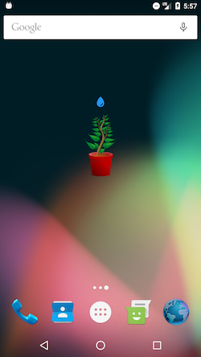

# Widget

  

Judul Project : My Garden. Widget.  
Nama : Nabila Tamimi  
Kelas : XII RPL 3  
Absen : 25  
NIS : 4779/1496.070   
Sekolah : SMK Telkom Malang  

# My Garden
Android AppWidgets lesson

## The app
My Garden is a simple game that allows you to add plants to your garden and keep them alive by watering them on time.
The app illustrates the power of widgets and collection widgets by making it easier for the user to monitor and water their plants from the home screen

## Screenshots

  
  

## Image resources
https://pixabay.com/en/sapling-plant-growing-seedling-154734/
https://pixabay.com/en/cactus-cacti-plant-thorns-spiky-152378/
https://pixabay.com/en/the-background-background-design-352165/
